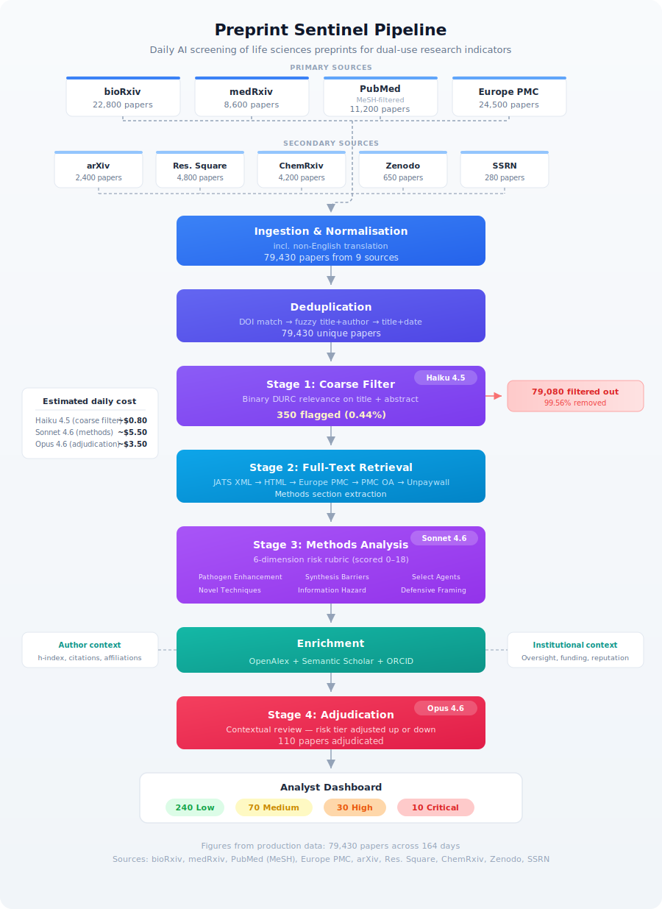

# DURC Preprint Triage System

An AI-enabled pipeline that monitors life sciences preprint servers and published literature daily, triaging papers for **dual-use research of concern (DURC)** indicators. The system reduces the volume of literature a human biosecurity analyst must review by ~99%, surfacing only papers with genuine dual-use risk signals.

This is a biosecurity tool intended for use by policy researchers, institutional biosafety committees, and oversight bodies. It is **not** a censorship tool -- it is an early-warning system.

## How it works

The pipeline ingests thousands of papers daily from four data sources, deduplicates them, and runs a three-stage AI classification cascade using progressively more capable (and expensive) models. Each stage narrows the funnel:

<p align="center">
  
</p>

### Design principles

- **High recall, moderate precision.** Missing a genuinely concerning paper is far worse than surfacing a false positive. The coarse filter errs heavily on the side of inclusion.
- **Human-in-the-loop.** The system produces risk assessments with reasoning chains. It does not make decisions. Every flagged paper must be reviewed by a qualified human analyst.
- **Auditability.** Every classification decision is logged with the full prompt, model response, and reasoning so analysts can understand *why* a paper was flagged.
- **Cost discipline.** Target <$5K/year in API costs. Haiku handles bulk filtering, Sonnet does methods analysis, Opus is reserved for ambiguous adjudication.

## Pipeline stages

### Stage 0: Ingestion

Daily ingestion from four sources (with architecture for five more):

| Source | Papers | Role |
|--------|--------|------|
| Europe PMC | 11,812 | Broadest coverage -- indexes 35+ preprint servers |
| PubMed | 8,452 | Published journal articles via NCBI E-utilities |
| bioRxiv | 6,579 | Biology preprints via CSHL API |
| medRxiv | 1,913 | Health sciences preprints via CSHL API |

*Counts from 230 days of ingestion.*

### Stage 0b: Deduplication

Three-tier dedup handles cross-posting (the same paper on bioRxiv *and* Europe PMC *and* later in PubMed):

1. **DOI exact match** -- indexed O(1) lookup, catches same paper across sources
2. **Fuzzy title + first-author surname** -- Levenshtein ratio > 0.92 within +/-14 days, handles slight title variations
3. **Title + author + date** -- for DOI-less papers, ratio > 0.88 within +/-7 days

### Stage 1: Coarse filter

**Model:** Claude Haiku (`claude-haiku-4-5-20251001`)
**Input:** Title + abstract only
**Concurrency:** 50 parallel API calls

Binary classification against a detailed DURC rubric. Papers are flagged as relevant if their abstract suggests *any* of:

- Enhancement of pathogen transmissibility, virulence, host range, or immune evasion
- Reconstruction or synthesis of dangerous pathogens (select agents, PPPs)
- Novel methods for producing biological toxins with harm potential
- Techniques lowering barriers to creating biological weapons
- Gain-of-function research on potential pandemic pathogens
- Novel delivery mechanisms for biological agents
- De novo protein design with toxin-like or pathogen-enhancing potential
- AI/ML methods applied to pathogen enhancement or bioweapon-relevant optimisation

The filter **fails open**: ambiguous or malformed LLM responses pass through rather than being silently dropped.

### Stage 2: Full-text retrieval

For papers passing the coarse filter, full text is retrieved through a cascade:

1. bioRxiv/medRxiv TDM XML (JATS format, author-consented)
2. bioRxiv/medRxiv HTML fallback
3. Europe PMC full text (CC-licensed)
4. PubMed Central Open Access
5. Unpaywall (XML/HTML, then PDF fallback)

The **methods section** is extracted specifically using JATS XML or HTML parsers, with PDF extraction via PyMuPDF as a last resort.

### Stage 3: Methods analysis

**Model:** Claude Sonnet (`claude-sonnet-4-6`)
**Input:** Methods section (or full text if unavailable) + abstract

Structured assessment against six risk dimensions, each scored 0-3:

| Dimension | What it measures |
|-----------|-----------------|
| Pathogen enhancement | Direct/indirect enhancement of transmissibility, virulence, host range |
| Synthesis barrier lowering | How much protocols simplify reproducing dangerous pathogens |
| Select agent relevance | Involvement with CDC Select Agents, WHO-listed pathogens, HG3/4 |
| Novel technique | Genuinely new dual-use techniques vs. incremental/established methods |
| Information hazard | Specific, actionable misuse information (sequences, protocols, routes) |
| Defensive framing (inverse) | Adequacy of dual-use discussion and risk mitigation |

**Risk tiers** from aggregate score (max 18):

| Tier | Score | Action |
|------|-------|--------|
| Low | 0-4 | Archive |
| Medium | 5-8 | Monitor -- include in weekly summary |
| High | 9-13 | Review -- daily digest, requires analyst attention |
| Critical | 14-18 | Escalate -- immediate notification |

### Stage 4: Adjudication

**Model:** Claude Opus (`claude-opus-4-6`)
**Input:** Full Stage 3 assessment + full text + enrichment data

Contextual review considering:

- **Author credibility** -- h-index, citation count, publication volume (via OpenAlex, Semantic Scholar)
- **Institutional context** -- research universities and government labs with oversight vs. unknown affiliations
- **Funding oversight** -- NIH, BARDA, DTRA, BBSRC, Wellcome Trust (agencies with DURC review processes)
- **Research context** -- incremental advance in a well-governed programme vs. concerning new direction

Risk tier can be adjusted up or down. A well-known virology lab with NIH funding and IBC approval may be downgraded; an unaffiliated author publishing detailed synthesis protocols may be upgraded.

### Non-English papers

Papers in non-English languages are automatically detected and translated (title, abstract, methods section) using Haiku before entering the classification stages.

## PubMed: MeSH-filtered vs. full ingestion

PubMed indexes ~3,000-4,000 new articles daily across all of biomedicine. Two query modes are available:

**MeSH-filtered mode (default):** Queries PubMed using a curated set of MeSH headings and free-text terms targeting DURC-relevant research -- virology, synthetic biology, gain-of-function, select agents, CRISPR, gene drives, directed evolution, etc. This returns ~800 papers/day.

**Full mode:** Ingests all new PubMed articles. Returns ~3,000-4,000 papers/day.

```
MeSH-filtered mode (default)
  PubMed daily volume:  ~3,500 articles
  After MeSH filter:      ~800 articles  (77% pre-filtered by NLM indexing)
  After coarse filter:     ~8 articles   (99% filtered by Haiku)
  Haiku API cost:        ~$0.30/day

Full mode
  PubMed daily volume:  ~3,500 articles
  After coarse filter:    ~35 articles   (99% filtered by Haiku)
  Haiku API cost:        ~$1.40/day
```

MeSH-filtered mode is the default because NLM's subject indexing is high-quality and free -- it removes the vast majority of irrelevant clinical trials, epidemiology studies, and basic research before any API cost is incurred. The tradeoff is that MeSH indexing can lag publication by days to weeks, and novel interdisciplinary work may not be tagged with expected headings. Full mode catches these edge cases at ~4x the Haiku cost.

The mode is toggled per-run from the dashboard and recorded in run history.

## Dashboard

A Next.js application for analyst review and pipeline management.

### Views

- **Daily feed** -- reverse-chronological list of flagged papers with risk tier badges, aggregate scores, and AI summaries. Filterable by risk tier, source server, review status, subject category, and full-text search.
- **Paper detail** -- full metadata, complete Stage 3 and 4 assessments with reasoning chains, methods section with highlighted concerns, author/institution enrichment context, analyst notes, and audit trail.
- **Analytics** -- papers processed per day/week, risk tier distribution over time, top flagged institutions and subject categories, dimension trend tracking.
- **Pipeline** -- trigger/cancel runs, run history with per-stage stats, data coverage heatmap, schedule configuration.
- **Settings** -- model selection, threshold tuning, API keys (admin only).

### Analyst workflow

Papers follow a review status workflow:

```
Unreviewed -> Under Review -> Confirmed Concern
                           -> False Positive
                           -> Archived
```

Each status change and analyst note is logged for auditability.

## Architecture

```
durc-preprints/
|-- pipeline/               Python backend
|   |-- ingest/             Source API clients + deduplication
|   |-- fulltext/           Full-text retrieval + JATS/HTML/PDF parsing
|   |-- triage/             LLM classification (coarse filter, methods, adjudication)
|   |-- enrichment/         OpenAlex, Semantic Scholar, ORCID clients
|   |-- orchestrator.py     Main pipeline orchestration
|   |-- models.py           SQLAlchemy ORM models
|   `-- config.py           Configuration via pydantic-settings
|
|-- dashboard/              Next.js 16 frontend
|   |-- app/                App Router pages + API routes
|   |-- components/         React components (shadcn/ui)
|   |-- lib/                Database queries, auth, utilities
|   `-- prisma/             Prisma schema (reads same PostgreSQL)
|
|-- alembic/                Database migrations
|-- docker-compose.yml      Local PostgreSQL
`-- docker-compose.prod.yml Production deployment
```

Both the pipeline (SQLAlchemy) and dashboard (Prisma) connect to the same PostgreSQL database. The pipeline writes papers and assessment data; the dashboard reads them and manages analyst workflow state.

## Tech stack

| Component | Technology |
|-----------|-----------|
| Pipeline | Python 3.11+, SQLAlchemy 2 (async), httpx, structlog |
| LLM | Anthropic API (Haiku / Sonnet / Opus) |
| Database | PostgreSQL 16, Alembic migrations |
| Dashboard | Next.js 16, React 19, Prisma 7, Tailwind CSS 4 |
| Auth | NextAuth v5 (GitHub + Google OAuth) |
| Charts | Recharts |
| Search | PostgreSQL full-text search (`tsvector`) |
| XML parsing | lxml (JATS), PyMuPDF (PDF) |
| Fuzzy matching | rapidfuzz |
| Scheduling | APScheduler |

## Setup

### Prerequisites

- Python 3.11+
- Node.js 18+
- PostgreSQL 16 (or use Docker)

### 1. Database

```bash
docker compose up -d    # starts PostgreSQL on localhost:5432
```

### 2. Environment

```bash
cp .env.example .env
# Edit .env with your Anthropic API key and any optional API keys
```

Required:
- `DATABASE_URL` -- PostgreSQL connection string
- `ANTHROPIC_API_KEY` -- Anthropic API key

Optional (all free, improve coverage):
- `NCBI_API_KEY` -- PubMed rate limit increase (10 req/s vs 3/s)
- `UNPAYWALL_EMAIL` -- full-text retrieval via Unpaywall
- `OPENALEX_EMAIL` -- author/institution enrichment

### 3. Pipeline

```bash
pip install -e .
alembic upgrade head       # run database migrations
python -m pipeline         # run pipeline manually
```

### 4. Dashboard

```bash
cd dashboard
npm install
npx prisma generate        # generate Prisma client
npm run dev                 # start on localhost:3000
```

## Running the pipeline

**From the dashboard:** Navigate to the Pipeline page and click "Run Pipeline". Configure date range and PubMed query mode as needed.

**From the command line:**

```bash
# Default: last 2 days, MeSH-filtered PubMed
python -m pipeline

# Custom date range
python -m pipeline --from-date 2026-03-01 --to-date 2026-03-31

# Full PubMed ingestion
python -m pipeline --pubmed-query-mode all
```

**Scheduled:** The pipeline can run on a daily cron via APScheduler (configurable hour in settings, default 06:00 UTC).

## Cost model

| Component | Monthly estimate |
|-----------|-----------------|
| Haiku (coarse filter, ~5K papers/day) | $15-30 |
| Sonnet (methods analysis, ~300 papers/day) | $150-240 |
| Opus (adjudication, ~15 papers/day) | $90-150 |
| Batch API discount (if enabled) | -50% on above |
| PostgreSQL (Supabase free tier or self-hosted) | $0-25 |
| VPS hosting | ~$20 |
| **Total** | **$280-470/month** |

Every LLM call is tracked with token counts and cost estimates. Per-run totals are visible in the dashboard's pipeline history.

## Legal and ethical notes

- All data sources are open access or explicitly permit text mining.
- bioRxiv/medRxiv TDM access is author-consented.
- Europe PMC content is CC-licensed where full text is available.
- The system analyses publicly available research outputs -- it does not access restricted content.
- If the system flags a paper representing a genuine and immediate biosecurity threat, the operating organisation should have a pre-agreed escalation pathway. This is a policy decision, not a technical one.

## License

This project is for research and institutional use. See [LICENSE](LICENSE) for details.
